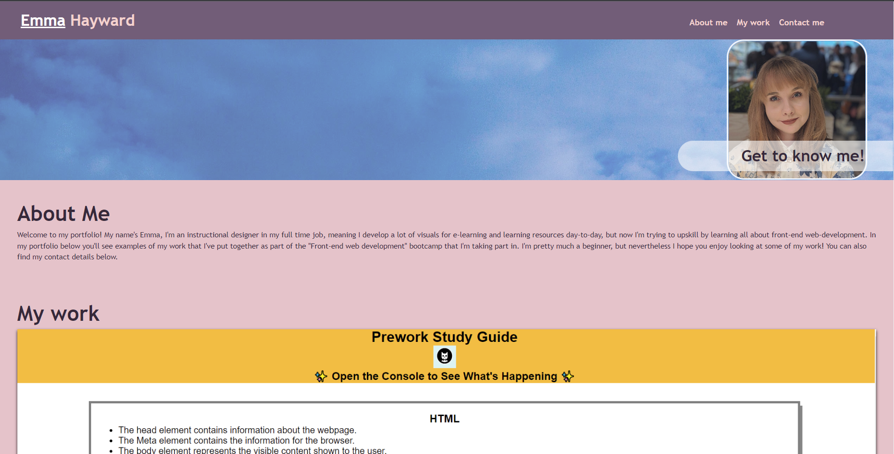

<Emma-H-Portfolio>

## Description

This project is a small get to know me and my work webpage. On this page, users can get to know a little bit more about me with my about me profile and a photo of me. They can also find more information about my motivations for trying out front end web development. The page contains hyperlinked cards to some of the pre-liminary work I've completed as part of the early stages of the "Front end web development" bootcamp I'm taking part in. Finally, visitors to the page can find my contact details as well as my linked in profile. 

This project has helped me to set up my first attempt at a coding protfolio. I enjoyed setting up the design, colours, images and header nav bar, however I did struggle setting up the grid cards in the "My work" section. I figured out how to get the cards to behave eventually, but it's something I would like to work on more in the future. I also learnt how to create hover effects for the cards, which I enjoyed playing about with. Finally, this project allowed me to have a go at using variables in CSS for reoccuring hex codes and font sizes, as well as implementing media queries for smaller device screens and mobile sized screens.

## Installation

My project is currently one web page based in a html index file and css style sheet, with a folder for images. Cloning this repository will allow visitors to have a closer look at the code, but the page can also be viewed in full here: https://emh93.github.io/EmmaH-Portfolio/ 

## Usage

You can visit my portfolio via the above url. The page itself is composed of four sections, which will be shown in the sections below:

1. The header - nav bar, hero image, and my profile photo. The nav bar items can be clicked to navigate any user to the desired section on the page.
2. The "About Me" section - the first section on the page.
Sections 1 and 2 are shown in the image below:

3. Area three is the "My Work" section where users can visit two of my previous coding attempts via the top two cards, and I have left space for future projects. Hovering over the cards will lower their transparency and change the box shadown around the border. The screenshot below shows this section on smaller screen - the cards are shown one to each row per the media query in action.

4. Finally the last area of the page is the "Contact me" footer. Users can find my email address, linked in profile, and a link to my GitHub profile.

Provide instructions and examples for use. Include screenshots as needed.

## Credits

Starter code - basic html doc set up and basic css provided by edX Front end web development web course.

Card hover effect taken from w3schools online web tutorials https://www.w3schools.com/ 

## License

MIT license 